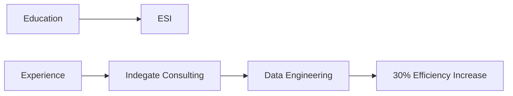

<div align="center">

# Welcome to my digital space.

### Data Science • Machine Learning • Innovation


</div>

## Hello, I'm Sami. 

I create intelligent solutions through data science and machine learning. Currently studying at ESI, I blend technical expertise with creative problem-solving to build the future of AI.

```python
class DataScientist:
    def __init__(self):
        self.name = "Sami Khalfi"
        self.role = "Data Scientist & ML Engineer"
        self.languages = ["Python", "R", "Java", "PHP"]
        self.interests = ["Machine Learning", "Computer Vision", 
                         "Time Series Analysis", "Data Engineering"]
```

## Innovation Through Intelligence

I specialize in transforming complex data challenges into elegant solutions. My work spans:

- 🤖 **Machine Learning** • Advanced model development and deployment
- 👁️ **Computer Vision** • Image processing and deep learning applications
- 📊 **Data Engineering** • Building robust data pipelines and infrastructure
- 📈 **Time Series** • Predictive analytics and forecasting

## Featured Creations

### Stock Trader Master
*Empowering financial decisions through AI*
- Sentiment analysis on financial articles using BERT
- Real-time market trend prediction
- Advanced NLP pipeline implementation

### Darna AI
*Revolutionizing real estate analytics*
- Recommendation system using PySpark & ALS
- Automated property analysis
- Real-time market insights

### Viticulture CV
*AI-powered agricultural innovation*
- 78.78% accuracy in disease detection
- 91% accuracy in pest identification
- Custom ResNet50 & Vision Transformer implementation

## Technical Expertise

<div align="center">

| Machine Learning | Data Engineering | Cloud & DevOps |
|:---------------:|:----------------:|:--------------:|
| TensorFlow | Apache Spark | AWS |
| PyTorch | Airflow | GCP |
| Scikit-learn | MongoDB | Docker |
| NLTK | Hadoop | FastAPI |

</div>

## Experience & Impact



## Let's Connect

<div align="center">

[](https://www.linkedin.com/in/samikhalfi/)
[](mailto:samikhalfi@esi.ac.ma)

</div>

## Analytics

<div align="center">


</div>

---

<div align="center">
<sub>Built with ☕️ by Sami Khalfi</sub>
</div>

